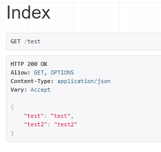
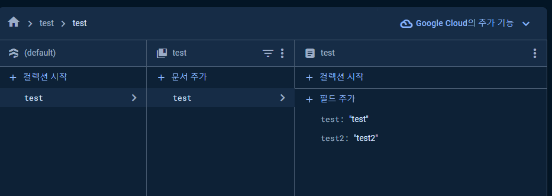

# Pumasi Backend
## 개발 환경
- Python (3.11.3)
- Django (4.0)
- Django Rest Framework (3.13.1)
- Firebase Admin (6.3.0)
- Django Dotenv (1.4.2)

코드잇에서 수강했던 [DRF강의 개발환경](https://www.codeit.kr/topics/django-rest-framework/lessons/5826) 을 참고하였습니다.

## 장고 환경 구성
- Project Name : Pumasi

- Apps    

  |   앱 이름    |             설명              |   
  |:---------:|:---------------------------:|   
  |   Care    | '맡기', '맡기기' 데이터 CRUD API 담당 |   
  |   User    |        미구현 (앱 이름 가칭)        |   
  | Community |        미구현 (앱 이름 가칭)        |
  |   Chat    |        미구현 (앱 이름 가칭)        |

## 실행 방법
1. 아래 코드를 실행하여 필요한 라이브러리를 설치합니다.   
    ```
    pip install django==4.0 djangorestframework==3.13.1
    pip install firebase-admin django-dotenv
    ```
2. 이 레포지토리의 최신 코드를 다운받습니다.   
   - 최초 실행   
   ```
   git clone https://github.com/GDSC-Hongik/pumasi-noodle-server.git
   ```
   - 최초 실행 이후에 실행 시   
   ```
   git pull https://github.com/GDSC-Hongik/pumasi-noodle-server.git
   ```
3. 레포지토리를 그대로 받은 뒤
    ``` cd "pumasi"``` 를 실행하여 프로젝트 폴더로 이동합니다.
4. 공유받은 .env 파일을 이동한 폴더에 추가합니다. (manage.py 와 같은 디렉토리에 있는지 확인합니다.)  
5. ```python manage.py runserver``` 을 실행합니다.
6. http://127.0.0.1:8000/test/ 에서 아래 화면이 나오는지 확인합니다.   
       
    24년 1월 9일 01:00 기준 데이터베이스에는 아래 이미지와 같은 형태로 데이터가 들어있습니다.      
       
    데이터베이스의 test 문서에 저장된 값과 동일한 리턴이 나오도록 테스트 코드를 작성하였습니다.   
7. 위 화면과 같이 잘 나온다면, 프론트에서 __runserver 명령어가 실행된 상태에서__ 위 주소에 GET 요청을 보냈을 때 위 이미지와 같은 형태의 JSON 데이터를 반환받습니다. 
